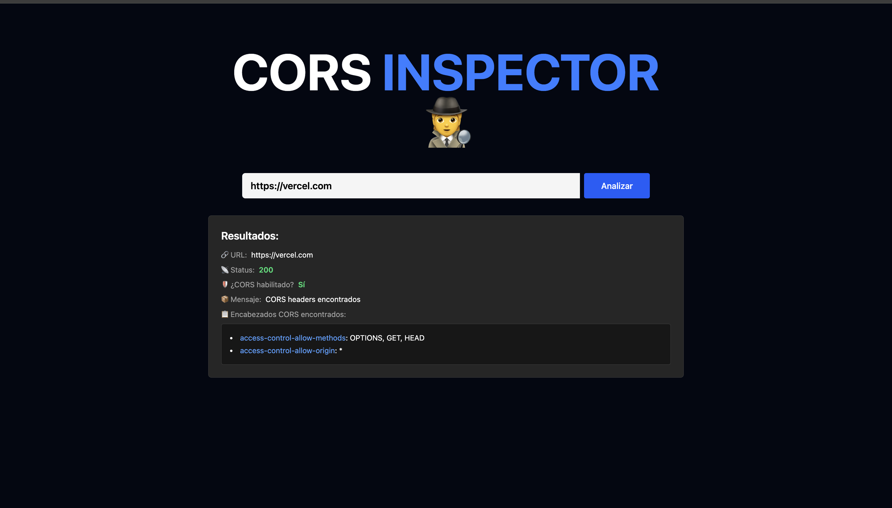

# CORS Inspector

CORS Inspector es una herramienta web sencilla que permite analizar la configuración de políticas CORS de cualquier servidor. Su objetivo es ayudar a desarrolladores y equipos de seguridad a identificar rápidamente si un endpoint tiene habilitados los encabezados CORS y cómo están configurados.

## Estado del proyecto

Actualmente, la herramienta se encuentra en **fase beta**. Por ahora, su única función es obtener y mostrar los encabezados CORS de una URL proporcionada por el usuario.

## Futuras funcionalidades

En próximas versiones se planea agregar:
- Análisis de posibles vulnerabilidades relacionadas con CORS utilizando inteligencia artificial.
- Integración con APIs externas como Shodan, SecurityHeaders, entre otras, para enriquecer el análisis de seguridad.
- Recomendaciones automáticas para mejorar la configuración de CORS.
- Valoración del nivel de riesgo según la configuración detectada.

## ¿Qué aprendí desarrollando este proyecto?

- Profundicé en el funcionamiento de las políticas CORS y su importancia en la seguridad web.
- Aprendí a consumir y analizar headers HTTP desde el frontend y backend.
- Mejoré mis habilidades en el desarrollo de interfaces simples y funcionales, priorizando la experiencia de usuario.
- Integré tecnologías modernas para construir una solución rápida y eficiente.

## ¿Cómo funciona?

La interfaz es muy sencilla: el usuario ingresa una URL en el campo de texto y presiona "Analizar". La aplicación muestra los encabezados CORS detectados, el estado de la respuesta y si CORS está habilitado o no.

## Stack tecnológico

- **Frontend:** React + Vite + Tailwind CSS
- **Backend:** Python + FastAPI + httpx

## Uso

1. Ingresa la URL del servidor que deseas analizar.
2. Haz clic en "Analizar".
3. Visualiza los resultados sobre los encabezados CORS y el estado de la configuración.

---
